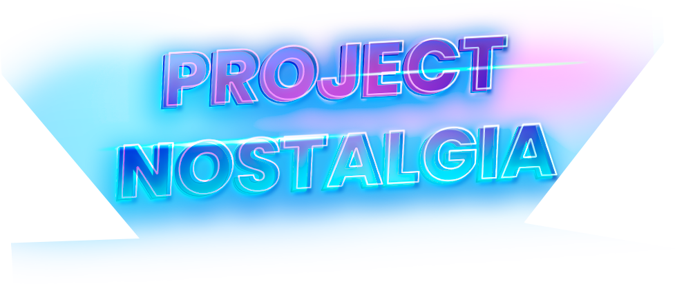

# Project Nastolgia

<h4 align="center">
  
</h4>

Этот проект представляет из себя игру, включающую в себя сразу три игры: 
- 🐍 Змейка - компьютерная игра, впервые появившаяся в кнопочном телефоне Nokia 6110,
- 🟥 Тетрис - компьютерная игра, первоначально изобретённая и разработанная советским программистом Алексеем Пажитновым,
- 🏓 Пинг-Понг - теннисная спортивная игра с использованием простой двумерной графики, разработанная и выпущенная фирмой Atari в 1972 году.

## Ресурсы

- Игровой движок - Unity 
- Язык программирования - C#
- Редактор кода - Visual Studio 2017

## Системные требования

Рекомундуемые:
- Процессор 2х ядерный Intel или AMD с поддержкой SSE
- Видеокарта с поддержкой DX9, DX10, DX11 (1024MB)
- Операционная система Windows 7 x86
- Оперативная память - 1GB

## Команда
- Команда разработчиков
  - Валенцов Александр - программист 👨‍💻
  - Великонис Айрис - дизайнер 🧙‍♂️
  - Геворгян Тигран - программист, lvl-дизайнер 👨‍💻
  - Гранин Дмитрий - программист 👨‍💻
- Команда тестировщиков
  - Гальчук Георгий - тестировщик 🕵️‍♂️
  - Ладаев Владислав - тестировщик 🕵️‍♂️
- Команда аналитиков
  - Касенова Дана - системный аналитик 🙇‍♀️
  - Красотина Арина - системный аналитик 🙇‍♀️
